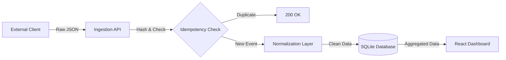

# 🛡️ Fault-Tolerant Data Processing System


A robust, full-stack data ingestion system designed to handle unreliable data from external clients. This system normalizes incoming JSON events, deduplicates them using content-addressable hashing, and provides consistent aggregated analytics even in the face of partial system failures.

---

## 🏗️ System Architecture

[Image of Fault tolerant system architecture diagram showing client, ingestion API, normalization, deduplication, SQLite DB, and Frontend]

The system follows a layered architecture to ensure separation of concerns:



---

## ✨ Key Features

* **⚡ Idempotency Engine**: Automatically detects and rejects duplicate events using SHA-256 hashing.
* **🔄 Normalization Layer**: Heuristically maps messy input fields (e.g., `cost`, `value`, `price`) to a canonical format.
* **🛡️ Failure Simulation**: Built-in UI toggle to simulate database crashes mid-request to test fault tolerance.
* **📊 Live Analytics**: Real-time aggregation of event data grouped by client.
* **🎨 Modern Dashboard**: A 3D-styled, responsive UI for monitoring system status and logs.

---

## 🚀 Getting Started

Follow these instructions to set up the project locally.

### Prerequisites
* **Node.js** (v14 or higher)
* **npm** (Node Package Manager)

### 1️⃣ Installation
Open your terminal in the root directory and run these commands:

**Backend Setup:**
```bash
cd backend
npm install
# Installs Express, SQLite3, CORS, Body-Parser
```

**Frontend Setup:**
```bash
cd ../frontend
npm install
# Installs React, Vite, and dependencies
```

### 2️⃣ Running the Application
You need to run the Backend and Frontend in two separate terminal windows.

Terminal 1 (Backend Service):
```bash
cd backend
node server.js
# Runs on http://localhost:3001
```

Terminal 2 (Frontend UI):
```bash
cd frontend
npm run dev
# Runs on http://localhost:5173
```

---

## 📝 Q&A (Assignment Deliverables)

### 1. What assumptions did you make?
* **Identical Payloads are Retries:** Since there is no unique Event ID provided by the client, I assume that if the exact same JSON payload (determined by SHA-256 hash) arrives, it is a retry of a previous request. This implies that two genuinely distinct transactions with identical data occurring at the same time will be treated as one.
* **Client Identification:** I assume the client ID is located in fields named `source`, `client`, or `id`.
* **Currency/Units:** I assume all "amount" fields are in the same currency/unit, as no conversion logic was requested.

### 2. How does your system prevent double counting?
I implemented a **Content-Addressable Hashing** strategy.
1.  Upon receipt, the raw JSON string is hashed using SHA-256.
2.  We check the database `events` table for this hash (`event_hash` column).
3.  If the hash exists, we return a `200 OK` immediately (Idempotent success) and skip processing/writing.
4.  If the hash does not exist, we process and insert it.
5.  The database enforces a `UNIQUE` constraint on the `event_hash` column to handle race conditions where two threads process the same payload simultaneously.

### 3. What happens if the database fails mid-request?
1.  The hash generation and normalization happen *in-memory* first.
2.  If the database write fails (e.g., connection lost), the API returns a `500` error to the client.
3.  **Crucially**, the event hash is **not** saved.
4.  The client is expected to retry the request.
5.  On the retry, since the hash wasn't saved previously, the system treats it as a new attempt and tries the write again. This ensures zero data loss and consistency.

### 4. What would break first at scale?
* **SQLite Locking:** SQLite allows only one writer at a time. High-concurrency writes would result in `SQLITE_BUSY` errors. Solution: Migrate to Postgres/MySQL.
* **Sequential Idempotency Check:** Checking the DB for the hash on every request adds latency. Solution: Use Redis for a fast, TTL-based unique lock for recent event hashes.
* **Normalization Heuristics:** The current "guess the field name" logic is O(N) on payload size and fragile. Solution: Implement a schema registry where clients are assigned specific versioned schemas.

---

## 📂 Project Structure

```bash
fault-tolerant-system/
├── backend/                  # Ingestion & Processing Layer
│   ├── server.js             # Main Application Logic
│   └── package.json
│
├── frontend/                 # UI & Visualization Layer
│   ├── src/
│   │   ├── App.jsx           # Dashboard Logic
│   │   └── App.css           # 3D/Glassmorphism Styling
│   └── vite.config.js
│
└── README.md                 # Documentation
